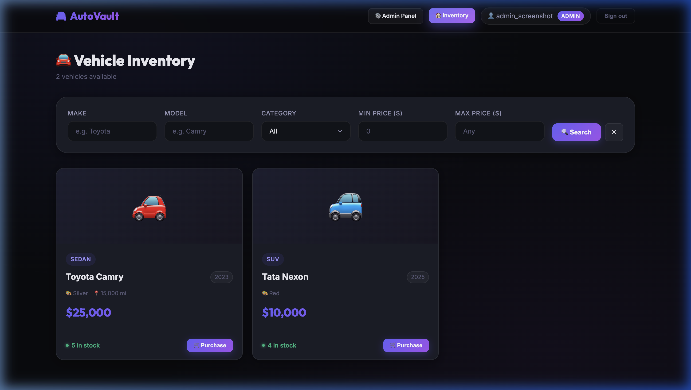
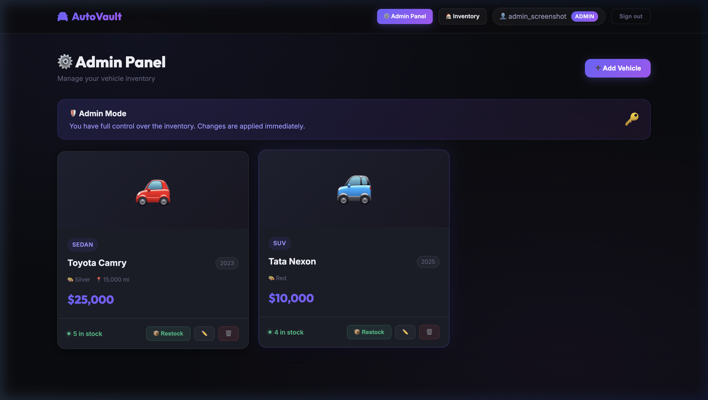

# 🚘 AutoVault — Car Dealership Inventory System

A full-stack car dealership inventory management system built with **Node.js/TypeScript (Express)**, **React**, and **PostgreSQL (Prisma ORM)**, following strict **Test-Driven Development (TDD)** practices.

---

## 📋 Project Overview

AutoVault is a role-based inventory management platform where:
- **Users** can browse and search vehicles, and purchase them (with real stock tracking)
- **Admins** can create, edit, delete, and restock vehicles

---

## 🛠 Tech Stack

| Layer | Technology |
|---|---|
| Backend API | Node.js + TypeScript + Express |
| ORM | Prisma v5 |
| Database | PostgreSQL 15 |
| Authentication | JWT (jsonwebtoken) + bcrypt |
| Backend Testing | Jest + ts-jest + Supertest |
| Frontend | React 18 + TypeScript + Vite |
| Frontend HTTP | Axios |
| Routing | React Router DOM v6 |
| Frontend Testing | Vitest + React Testing Library |
| Styling | Vanilla CSS (custom design system) |

---

## 🚀 Setup Instructions

### Prerequisites
- Node.js ≥ 18
- PostgreSQL 15 (via Homebrew: `brew install postgresql@15 && brew services start postgresql@15`)

### 1. Clone and create databases

```bash
git clone <repo-url>
cd car-dealership-inventory

# Create databases
createdb car_dealership
createdb car_dealership_test
```

### 2. Backend Setup

```bash
cd backend
cp .env.example .env
# Edit .env — set DATABASE_URL and JWT_SECRET

npm install
npx prisma migrate dev       # Run migrations on dev DB
DATABASE_URL="postgresql://user@localhost:5432/car_dealership_test" npx prisma migrate deploy  # Test DB
npm run dev                  # Start on http://localhost:5000
```

### 3. Frontend Setup

```bash
cd frontend
cp .env.example .env
# Edit .env — set VITE_API_URL=http://localhost:5000

npm install
npm run dev                  # Start on http://localhost:5173
```

### 4. Create an Admin User

After registering via the UI (which creates a USER role), promote to ADMIN via psql:

```sql
UPDATE "User" SET role = 'ADMIN' WHERE email = 'your@email.com';
```

---

## 🔌 API Reference

| Method | Endpoint | Auth | Description |
|---|---|---|---|
| POST | `/api/auth/register` | — | Register a new user |
| POST | `/api/auth/login` | — | Login, returns JWT |
| GET | `/api/vehicles` | User | List all vehicles |
| GET | `/api/vehicles/search` | User | Search with filters |
| GET | `/api/vehicles/:id` | User | Get vehicle by ID |
| POST | `/api/vehicles` | Admin | Create vehicle |
| PUT | `/api/vehicles/:id` | Admin | Update vehicle |
| DELETE | `/api/vehicles/:id` | Admin | Delete vehicle |
| POST | `/api/vehicles/:id/purchase` | User | Purchase (decrement stock) |
| POST | `/api/vehicles/:id/restock` | Admin | Restock (increment stock) |

**Search query params:** `?make=&model=&category=&minPrice=&maxPrice=`

---

## 🧪 Running Tests

### Backend (Jest + Supertest — 34 tests)

```bash
cd backend
npm test                     # Run all tests
npm run test:coverage        # With coverage report
```

### Frontend (Vitest + RTL — 10 tests)

```bash
cd frontend
npm test                     # Run all tests
```

---

## 📊 Test Coverage Report

```
Backend: 34 tests passing across 2 suites
 - auth.test.ts: 12 tests (register, login, auth middleware)
 - vehicles.test.ts: 22 tests (CRUD, search, purchase, restock, role checks)

Frontend: 10 tests passing
 - VehicleCard.test.tsx: 10 tests (stock states, purchase button, admin controls)
```

Run `npm run test:coverage` in the backend directory for the full coverage table.

---

## 🤖 My AI Usage

**Tools used:** Antigravity (Google DeepMind Advanced Agentic Coding assistant)

**Concrete examples of AI assistance:**
- Scaffolded the initial Prisma schema and Express folder structure
- Generated the Jest/Supertest boilerplate for auth and vehicle test suites (the happy-path structure)
- Wrote the central error handler middleware and typed auth middleware patterns
- Generated the full dark-mode CSS design system tokens and component styles
- Scaffolded React components (VehicleCard, VehicleForm, Navbar, Toast)

**What I wrote myself or heavily modified:**
- Purchase/restock edge-case tests (zero stock, over-purchase, negative restock)
- The `createAdmin` helper in vehicle tests (understanding the DB-level role promotion needed for tests)
- The search filter logic in `vehicle.service.ts` (Prisma `contains` + `mode: insensitive`)
- Debugging the ts-jest/TypeScript 6 incompatibility and downgrading to TS 5
- Debugging the test database connection issue (`.env.test` not loading before Prisma client construction)
- Fixing `req.params.id` strict TypeScript typing

**Genuine reflection:**
AI significantly sped up boilerplate generation — scaffolding 19 files in a consistent architecture would have taken 2-3 hours manually. However, AI got the TypeScript version wrong (installed TS 6 which broke ts-jest) and missed the test database connection bug (Prisma client constructing before `.env.test` loaded). Both required real debugging. The AI-generated tests also needed refinement — the initial purchase button test queried by the wrong aria-label. These fixes were straightforward once I understood the error, but they demonstrate that AI output needs active review.

---

## 🔐 Security Note

JWT tokens are stored in `localStorage` for simplicity. **Tradeoff:** This is vulnerable to XSS attacks. A production implementation should use httpOnly cookies with a refresh token rotation strategy. This is noted here as a conscious architectural decision for this scope.

---

## 📸 Screenshots

### 🏠 Inventory Dashboard (Regular / Admin View)


### ⚙️ Admin Panel (Management Actions & Add Form)

